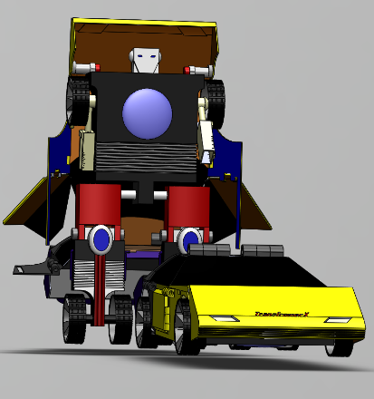
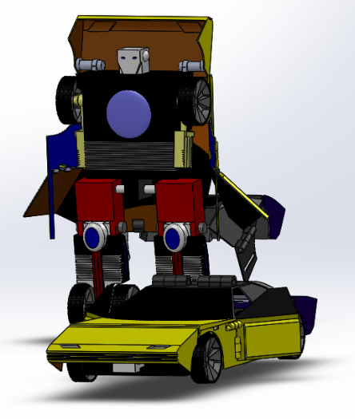
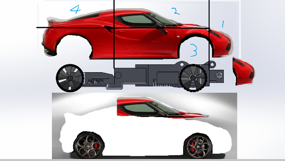
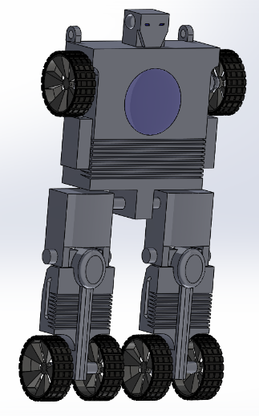
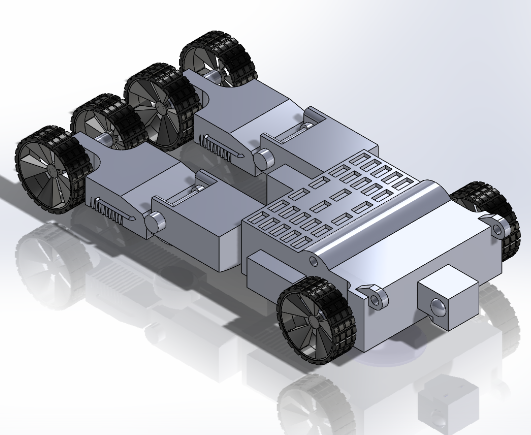
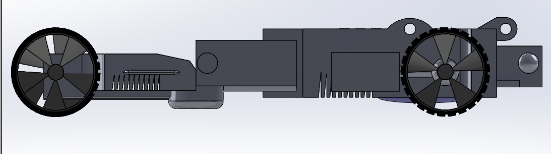

# TransformerXXX
Final project for ME 123

Transformer built with Solidworks. Not that sophisticated as that "Transformer". Around 20 hours of work. (one of five contest winners of the class)

Copyright Kaiyu Zheng
